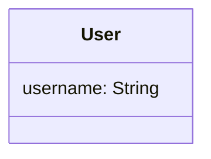
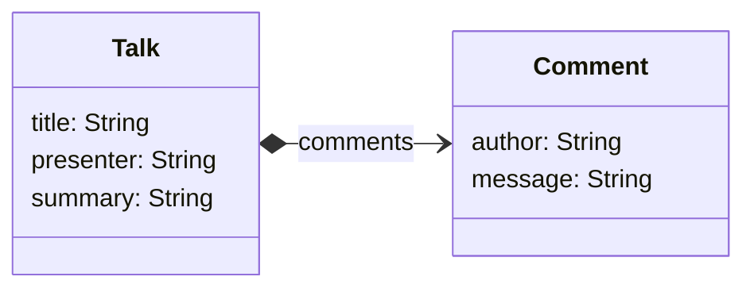
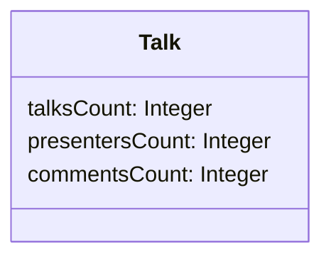
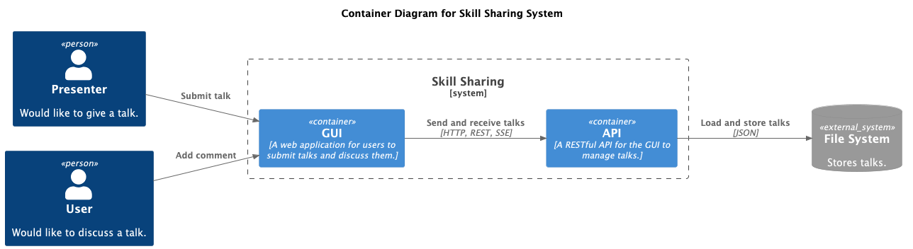

# Skill Sharing

## Domain

### Change user

- Updates username

### User

- Anon is the default user
- Gets stored user

### Submit talk

- Adds talk to list

### Add comment

- Adds comment to an existing talk
- Reports an error if talk does not exists

### Delete talk

- Removes talk from list
- Ignores already removed talk

### Talks

- Lists all talks

### Metrics

- Count talks and presenters

## Aggregates

### Users

### Talks

### Metrics

## Architecture

