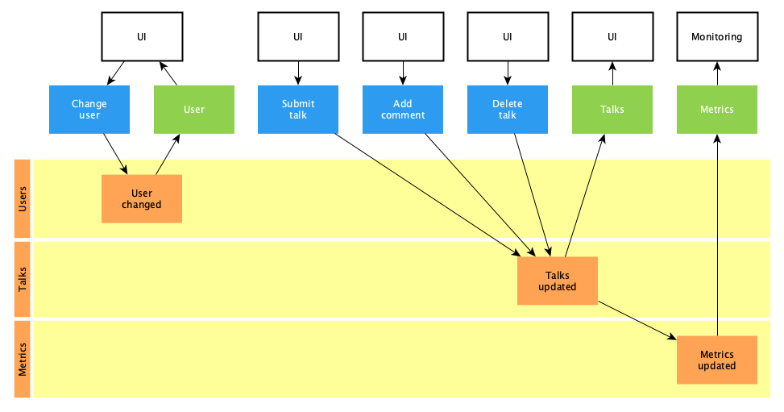

# Skill Sharing

## Domain

### Change user

-   Updates user name

### User

-   Anon is the default user
-   Is stored user

### Submit talk

-   Submits talk
-   Adds talk to list of talks

### Post comment

-   Posts comment
-   Adds comment to an existing talk
-   Reports an error if talk does not exists

### Delete talk

-   Deletes talk
-   Removes talk from list

### Talks

-   Polls talks
-   Does not update talks, if not modified
-   Recovers after error
-   Is a list of talks

### Talk

-   Is a single talk
-   Is undefined if talk does not exist
